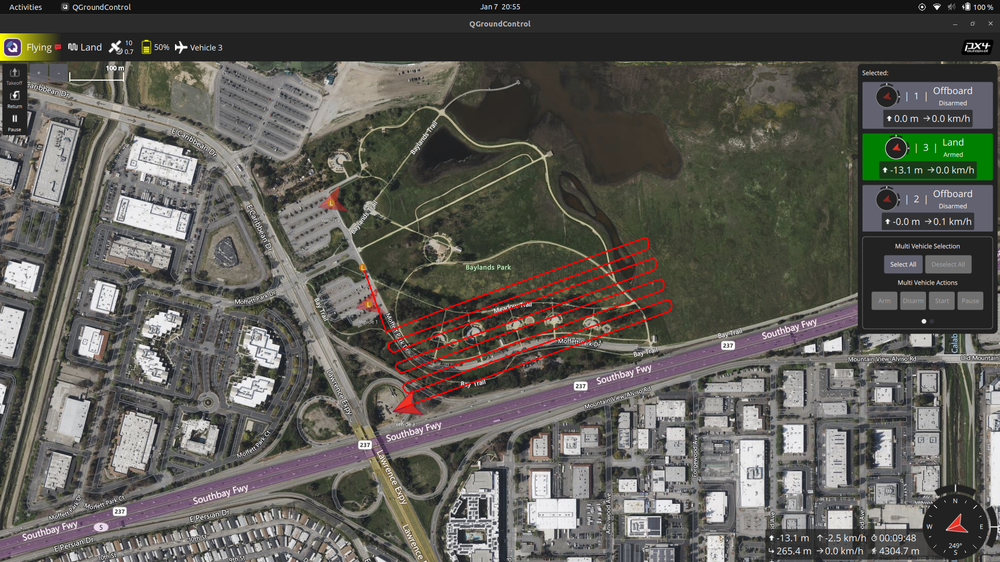
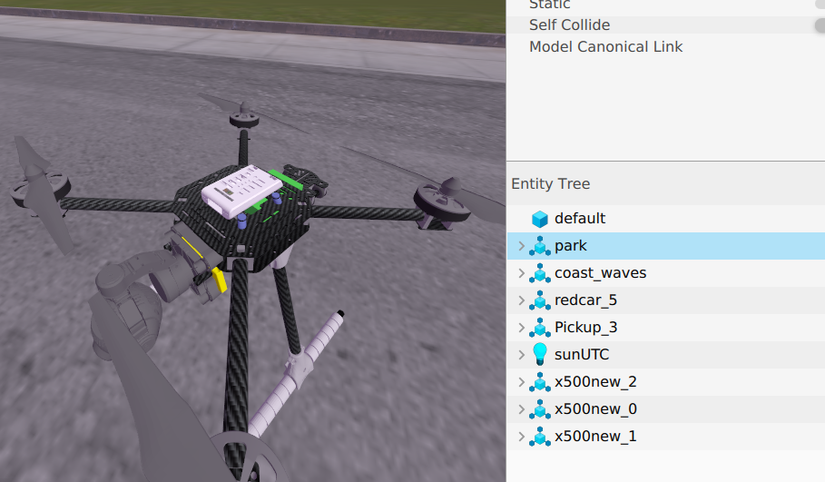

# Autonomous UAV Swarm for Secure Zone Reconnaissance 

This project was a team effort made by:

Mohammed Alsuhaim
Nasser Alahmari
Shafi Albogami 


## Project Overview
This project simulates a swarm of autonomous Unmanned Aerial Vehicles (UAVs) designed to secure restricted zones without human intervention. The system utilizes **ROS 2**, **Gazebo**, and **AI** to execute coordinated "Search and Sweep" missions.

Unlike traditional patrols, this swarm flies a coordinated grid pattern and uses onboard **Computer Vision** to detect unauthorized vehicles in real-time. When a threat is detected, the system logs the incident and saves photographic evidence automatically.

# Key Features
AI Threat Detection: Custom TensorFlow model (CNN) detects vehicles with >80% confidence.
Auto-Documentation: Automatically captures and saves timestamped images of intrusions.

# Technologies Used
  Simulation: ROS 2, Gazebo .
  Control: MAVSDK, PX4 Autopilot.
  AI/Vision: TensorFlow, Keras, OpenCV.

# Installation & Setup

1. **Clone the Repository**
   ```bash
   git clone [https://github.com/qeafs/Secure-Zone-Swarm.git](https://github.com/qeafs/Secure-Zone-Swarm.git)
   cd Secure-Zone-Swarm

   ```
   # install the requiredments
   ```
   pip3 install -r requirements.txt
  `` 
  Launch your PX4/Gazebo environment with 3 drones (x500).

  Start the ROS-Gazebo Bridge for the camera:
  ```
   ros2 run ros_gz_bridge parameter_bridge /world/baylandsnew/model/x500new_1/link/camera_link/sensor/camera/image@sensor_msgs/msg/Image@gz.msgs.Image
```
# Demo

### 1. Swarm Flight (Grid Search)



